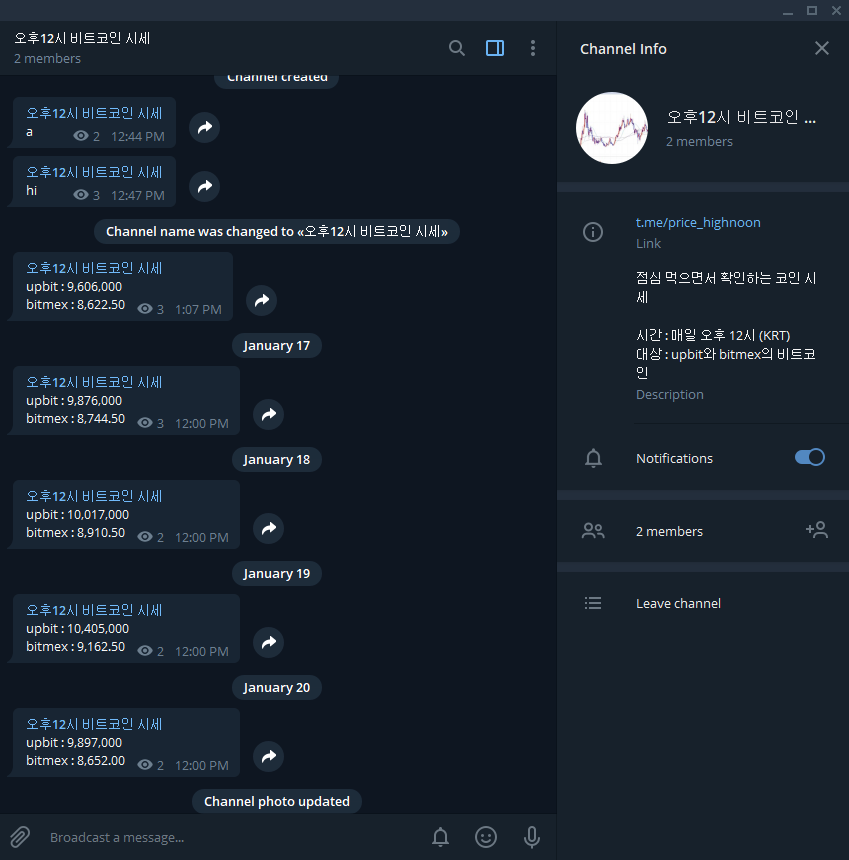
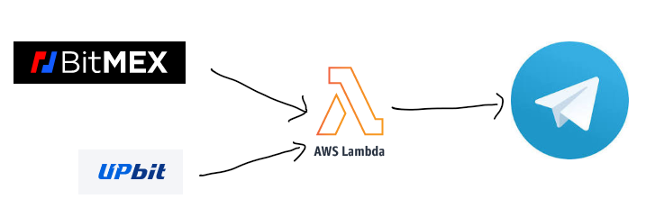

# 오후12시 비트코인 시세
## 개요
다른 투자 대상도 마찬가지지만 비트코인의 시세도 매 시간마다 변동하는데요  
그렇지만 여러 이유로 매 시간마다 시세를 보지 않는 경우에 유용할 거 같아서  
보통 점심시간이 시작하는 오후 12시(KRT)에 대표적인 거래소 사이트인  
업비트와 bitmex의 비트코인 시세를 알려주는 채널을 개설 했습니다.  

**https://t.me/price_highnoon**

위에 있는 링크를 클릭하면 해당 채널로 들어갈 수 있습니다.

1비트 코인의 값을 보여줄때 단위는  
upbit는 원(BTC/KRW) bitmex는 달러(BTC/USD)입니다.

하루에 한번 시세는 다음과 같이 bitmex와 upbit에서 받아서  
telegram에 개설된 해당 채널로 보내게 됩니다.  
  
여기서 AWS Lambda는 서버의 역할을 한다고 보면 됩니다.  

## 파일
[lambda_function.py](lambda_function.py) : aws lambda에 올라가는 코드  

## 참고
### REST API를 이용한 업비트 시세 수신  
https://docs.upbit.com/docs/upbit-quotation-restful-api

### bitmex 호가 수신  
https://www.bitmex.com/api/explorer/#!/OrderBook/OrderBook_getL2

### aws lambda에 layer를 추가해서 requests모듈 사용  
https://github.com/mthenw/awesome-layers  
-> https://github.com/keithrozario/Klayers  
-> https://github.com/keithrozario/Klayers/blob/master/arns/ap-northeast-2.json  
